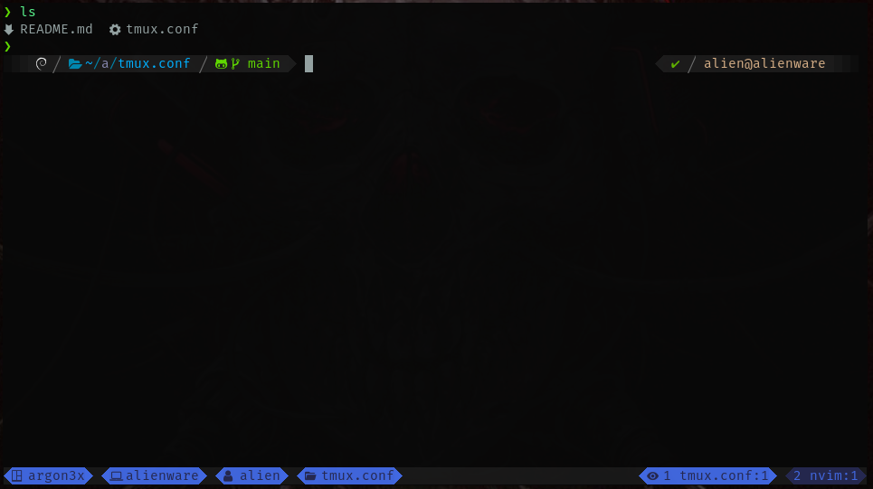

# Archivo de configuración tmux

## Descripción

Esté es un archivo de configuración para darle un estilo a `tmux`

El `prefix` que usa por defecto es `alt+f` pero puede ser remplazado por cualquier otro, ya sea usando \
`ctrl` o `alt` seguido de cualquier letra, solo se tienen que modificar las lineas `6` `7` y `8` ya que \
son variables que almacenarán el nuevo prefix, y la forma en la que se dividen los paneles ya sea de \
forma horizontal o vertical.

Tomar en cuenta que para usar `ctrl` se usa `C` y para `alt` se utiliza `M` seguido de una letra.

## Instalación

* clonar el repositorio

```bash
$ https://github.com/argon3x/tmux.conf.git 
```

* puedes copiar o mover el archivo `tmux.conf` a tu home

```bash
$ cp $PWD/tmux.conf/tmux.conf ~/.tmux.conf

$ mv $PWD/tmux.conf/tmux.conf ~/.tmux.conf
```

* o puedes hacer un enlace simbólico

```bash
$ ln -svf $PWD/tmux.conf/tmux.conf ~/.tmux.conf
```

## Nota

para poder visualizar bien los iconos (`unicode`) se debe tener instalada una fuente de tipo NerdFonts, referencia: [https://www.nerdfonts.com/](https://www.nerdfonts.com/)

## Screenshot


